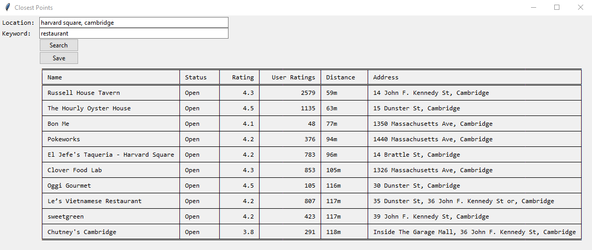
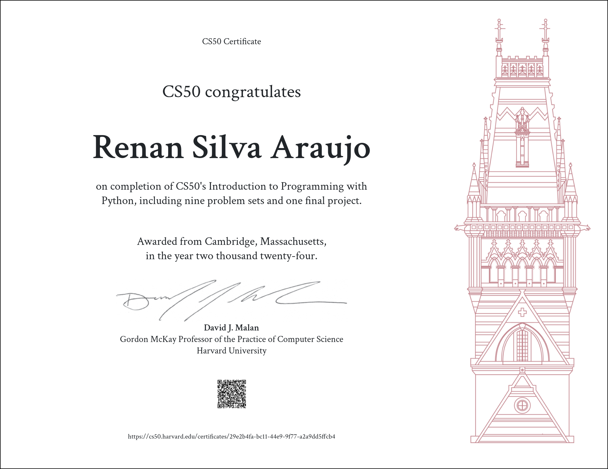

#  Closest Points
Renan Silva Araujo

HarvardX CS50P, CS50's Introduction to Programming with Python

_Python version 3.12.1_

##  Video Demo:  https://youtu.be/ttBk_kjsFDU
##  Description:
 Closest points is a simple project designed to facilitate the search for nearby places based on a given location and keyword. Whether you are looking for a specific type of establishment like a restaurant or cafe, or general landmarks within your location, this project simplifies the search and gives you the necessary information to make an informed choice.
## Key features:
- __Proximity based Search:__ The core functionality revolves around conducting a straightforward search for places ranked by their proximity to the provided location. Users can input various location references, including specific addresses, cities, countries or even specific establishments.
* __Information Display:__ The application presents the search results in a neatly organized table format. Each entry includes essential details such as the name of the place, its current status (open or closed), rating based on google reviews, the number of user reviews contributing to the rating, the distance from the user location, and the specific address.
+ __Data Export:__ Users have the option to save the entire table, complete with all relevant information, to a text file. This feature enables users to print the results or utilize the data elsewhere as needed.
## Example:

## Prerequisites:
- Python 3.6.x
- geopy==2.4.1
- python-dotenv==1.0.1
- requests==2.31.0
- tabulate==0.9.0
- Google Places API Key
## Setup:
1. Clone this repository:
```
git clone <https://github.com/rsaraujo21/closestpoints>
```
2. Install the required python libraries:
```
pip install -r requirements.txt
```
3. Change into the project directory:
```
cd <path/project>
```
4. Run the project:
```
python project.py
```
## Structure:
- `project.py`: Contains all the statements necessary to run the project.
- `test_project.py`: Contains test functions for all the statements in project.py.
- `requirements.txt`: Contains all the prerequisite libraries to run the project.
- `README.md`: File explaining the project.

## Testing:
- Install pytest:
```
pip install pytest
```
- Run tests:
```
pytest test_project.py
```


## What i learned:
- Setting up and managing API keys securely using environment variables with python-dotenv.
- Making API calls and handling responses using the requests library.
- Processing JSON data returned by an API and extracting relevant information.
- Formatting processed data into a human-readable table using the tabulate library.
- Building a basic GUI with Tkinter, including creating custom widgets and handling user input.
- Utilizing StringVar and TextVariable for dynamic UI updates in response to user actions.
- Structuring the project with a focus on single responsibility principles, although requiring improvement.
- Implementing error handling to manage exceptions and provide clear feedback to the user.
- Integrating multiple libraries to perform various functionalities.
- Writing unit tests with unittest.mock to isolate functions and simulate external dependencies.
- Using patch, MagicMock, and other mocking techniques to test individual functions in isolation.

### 
